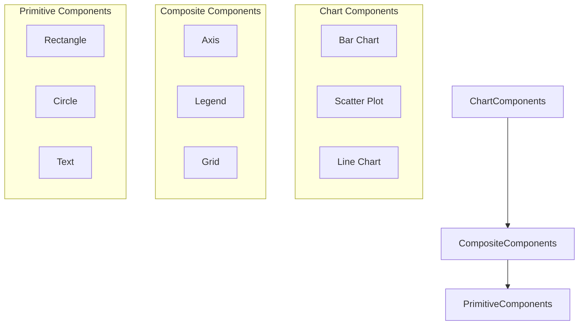
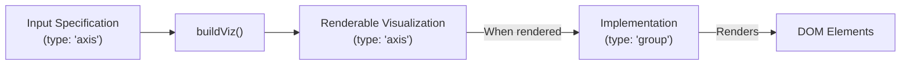
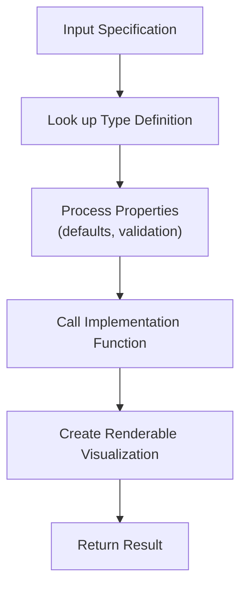
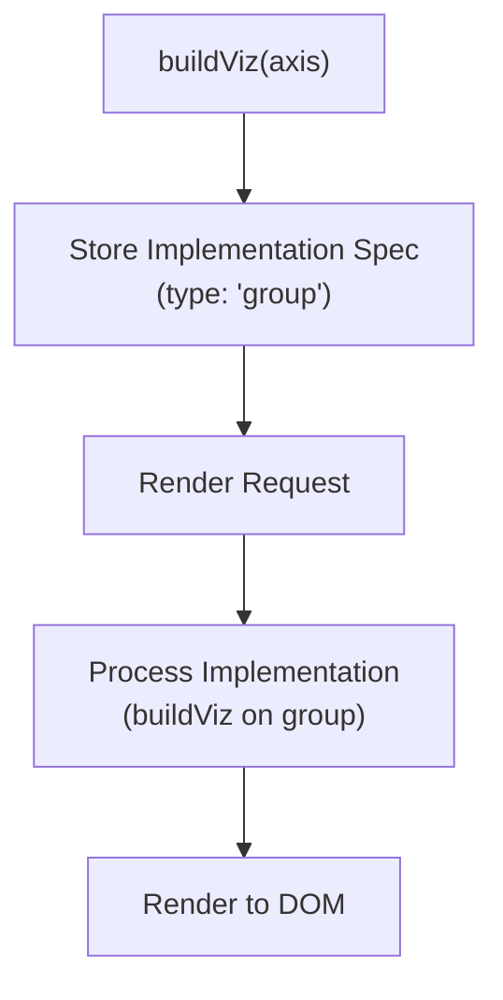
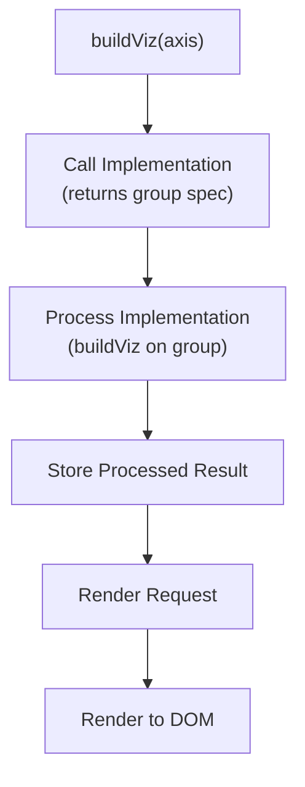

# Component Implementation Design

## Overview

This document outlines the design patterns for implementing components in Devize, focusing on how higher-level components like axes, legends, and charts are built on top of primitive visualizations. It also clarifies the distinction between primitive components and composite components.

## Component Hierarchy

Devize's visualization system is organized in a hierarchical structure:

1. **Primitive Components**: Basic visual elements (rectangle, circle, line, text)
2. **Composite Components**: Combinations of primitives (axis, legend, grid)
3. **Chart Components**: Full-featured visualizations (bar chart, scatter plot, line chart)

```
┌─────────────────────────────────────────────────────────┐
│                   Chart Components                       │
│  ┌─────────────────┐  ┌─────────────────┐  ┌──────────┐  │
│  │   Bar Chart     │  │  Scatter Plot   │  │Line Chart│  │
│  └─────────────────┘  └─────────────────┘  └──────────┘  │
└─────────────────────────────────────────────────────────┘
                           │
                           ▼
┌─────────────────────────────────────────────────────────┐
│                 Composite Components                     │
│  ┌─────────────────┐  ┌─────────────────┐  ┌──────────┐  │
│  │      Axis       │  │     Legend      │  │   Grid   │  │
│  └─────────────────┘  └─────────────────┘  └──────────┘  │
└─────────────────────────────────────────────────────────┘
                           │
                           ▼
┌─────────────────────────────────────────────────────────┐
│                  Primitive Components                    │
│  ┌─────────────────┐  ┌─────────────────┐  ┌──────────┐  │
│  │    Rectangle    │  │     Circle      │  │   Text   │  │
│  └─────────────────┘  └─────────────────┘  └──────────┘  │
└─────────────────────────────────────────────────────────┘
```



## Implementation Patterns and Transformation Flow

### The Transformation Flow

When a visualization specification is processed by `buildViz`, it undergoes a transformation:



This flow preserves the semantic type of the visualization while transforming it into a renderable form.

### 1. Primitive Components

Primitive components can be implemented in two ways:

#### Direct Rendering Functions

```javascript
buildViz({
  type: "define",
  name: "rectangle",
  properties: {
    x: { default: 0 },
    y: { default: 0 },
    width: { required: true },
    height: { required: true },
    fill: { default: "none" },
    stroke: { default: "none" },
    strokeWidth: { default: 1 }
  },
  implementation: props => {
    // Return rendering functions
    return {
      renderSVG: container => {
        const rect = document.createElementNS("http://www.w3.org/2000/svg", "rect");
        // Set attributes from props
        container.appendChild(rect);
        return rect;
      },
      renderCanvas: ctx => {
        ctx.fillStyle = props.fill;
        ctx.fillRect(props.x, props.y, props.width, props.height);
        return true;
      }
    };
  }
});
```

#### Lower-Level Specification

Even primitives can return a specification if they can be implemented in terms of even more basic elements:

```javascript
buildViz({
  type: "define",
  name: "roundedRectangle",
  properties: {
    x: { default: 0 },
    y: { default: 0 },
    width: { required: true },
    height: { required: true },
    cornerRadius: { default: 5 },
    fill: { default: "none" }
  },
  implementation: props => {
    // Return a path specification
    return {
      type: "path",
      d: createRoundedRectPath(props.x, props.y, props.width, props.height, props.cornerRadius),
      fill: props.fill
    };
  }
});
```

### 2. Composite Components

Composite components return a specification for a lower-level renderable visualization:

```javascript
buildViz({
  type: "define",
  name: "axis",
  properties: {
    orientation: { required: true },
    length: { required: true },
    values: { required: true },
    // ...other properties
  },
  implementation: props => {
    // Process properties

    // Return a specification for a group containing primitive elements
    return {
      type: "group",
      children: [
        // Axis line
        {
          type: "line",
          // ...properties
        },
        // Ticks and labels
        // ...more elements
      ]
    };
  }
});
```

## The buildViz Process

When `buildViz` processes a visualization specification, it:

1. Looks up the type definition
2. Applies default values and validates properties
3. Calls the implementation function with the processed properties
4. Creates a `RenderableVisualization` object that:
   - Preserves the original type (e.g., "axis")
   - Stores the implementation result internally
   - Provides rendering methods that use the implementation result



## Implementation Result Storage

The implementation result is stored in the `RenderableVisualization` object and can be accessed using the `getProperty` method:

```javascript
const axis = buildViz({
  type: "axis",
  orientation: "bottom",
  length: 500,
  values: [0, 25, 50, 75, 100]
});

// The axis object maintains its type
console.log(axis.type); // "axis"

// The implementation result can be accessed
const implementation = axis.getProperty('implementation');
console.log(implementation.type); // "group"
```

## Lazy vs. Eager Evaluation

There are two possible approaches to processing the implementation result:

### 1. Lazy Evaluation (Deferred Processing)

The implementation result is stored as a specification and only processed when rendering is requested:



### 2. Eager Evaluation (Immediate Processing)

The implementation result is immediately processed into a renderable form:



Both approaches have trade-offs:
- Lazy evaluation delays processing until needed but may result in repeated processing
- Eager evaluation processes everything upfront but may process things that are never rendered

## Memory Management Considerations

As you pointed out, memory management is an important consideration:

1. **Property Retention**: Once the implementation has been called, the original properties may no longer be needed for rendering
2. **Implementation Caching**: The processed implementation could be cached to avoid repeated processing
3. **Garbage Collection**: Large property objects should be released when no longer needed

A potential approach is to create a "frozen" version of the visualization after processing:

```javascript
function buildViz(spec) {
  // Process the specification
  const processedSpec = processSpecification(spec, typeDefinition);

  // Call the implementation function
  const implementationResult = typeDefinition.implementation(processedSpec);

  // Create a renderable visualization that doesn't retain the original properties
  return {
    type: spec.type,
    implementation: implementationResult,
    render: container => {
      // Use the implementation result to render
    },
    // Other methods
  };
}
```

## Special Case: Primitives with Direct Rendering

Primitives that return only rendering functions are indeed a special case:

```javascript
implementation: props => {
  return {
    renderSVG: container => { /* SVG rendering */ },
    renderCanvas: ctx => { /* Canvas rendering */ }
  };
}
```

These could be handled by:
1. Detecting the return type (rendering functions vs. specification)
2. Using a different rendering path for each case
3. Providing a consistent interface regardless of the implementation approach

## Unified Model

A unified model could treat all implementations as returning a "renderable result" that could be either:
1. A specification for another visualization type
2. Direct rendering functions
3. A combination of both

```javascript
interface RenderableResult {
  // If it's a specification
  type?: string;
  [key: string]: any;

  // If it's rendering functions
  renderSVG?: (container: SVGElement) => SVGElement;
  renderCanvas?: (ctx: CanvasRenderingContext2D) => void;
}
```

The `buildViz` function would then handle both cases transparently.

## Best Practices

### 1. Use the Right Level of Abstraction

- Use primitive components for basic visual elements
- Use composite components for reusable UI elements
- Use chart components for complete visualizations

### 2. Prefer Specification-Based Implementation

- Return specifications rather than rendering functions when possible
- Use direct rendering functions only when necessary

### 3. Maintain Semantic Types

- Name components based on their semantic meaning, not their implementation
- Preserve the original type in the returned object

### 4. Consider Memory Management

- Release property objects when no longer needed
- Cache processed implementations when appropriate
- Be mindful of large data structures

## Renaming Considerations

Based on this design pattern, we should consider renaming the directories:

- `src/primitives` remains for basic visual elements
- `src/components` could be renamed to `src/composites` for clarity
- `src/charts` could be added for full-featured visualizations

This naming would better reflect the hierarchical nature of the component system.

## References

- Related File: [src/core/define.ts](../src/core/define.ts)
- Related File: [src/core/builder.ts](../src/core/builder.ts)
- Related File: [src/primitives/rectangle.ts](../src/primitives/rectangle.ts)
- Related File: [src/components/axis.ts](../src/components/axis.ts)
- Design Document: [design/define.md](define.md)
- Design Document: [design/primitive_implementation.md](primitive_implementation.md)
- Design Document: [design/viz_creation_rendering.md](viz_creation_rendering.md)
