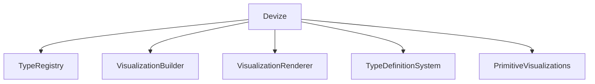
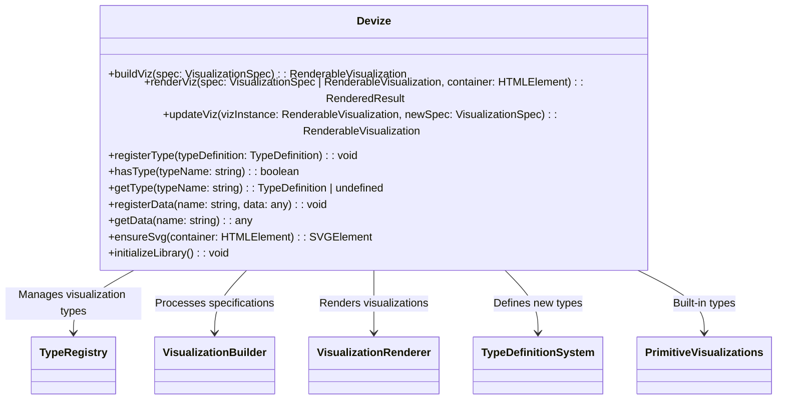

# Devize System Architecture

## Overview

This document outlines the architecture of the Devize system as a whole, focusing on how the core components are integrated into a cohesive library that users can load into web pages. The central file `src/core/devize.ts` serves as the main entry point and public API for the Devize visualization library.

## System Architecture

### Core Components

The Devize system consists of several core components that work together:

1. **Type Registry**: Manages visualization type definitions (`src/core/registry.ts`)
2. **Visualization Builder**: Processes specifications into renderable objects (`src/core/builder.ts`)
3. **Visualization Renderer**: Renders visualizations to DOM containers (`src/core/renderer.ts`)
4. **Type Definition System**: Allows defining new visualization types (`src/core/define.ts`)
5. **Primitive Visualizations**: Built-in visualization types (`src/primitives/`)
6. **Main Entry Point**: Integrates all components and provides the public API (`src/core/devize.ts`)

```
┌─────────────────────────────────────────────────────────────────┐
│                        src/core/devize.ts                       │
│                                                                 │
│  ┌─────────────┐   ┌─────────────┐   ┌─────────────────────┐    │
│  │ Type        │   │ Visualization│   │ Visualization      │    │
│  │ Registry    │◄──┤ Builder     │◄──┤ Renderer           │    │
│  │             │   │             │   │                     │    │
│  └─────────────┘   └─────────────┘   └─────────────────────┘    │
│         ▲                 ▲                     ▲                │
│         │                 │                     │                │
│         │                 │                     │                │
│  ┌─────────────┐   ┌─────────────┐   ┌─────────────────────┐    │
│  │ Type        │   │ Primitive   │   │ Utility             │    │
│  │ Definition  │   │ Visualizations│ │ Functions           │    │
│  │ System      │   │             │   │                     │    │
│  └─────────────┘   └─────────────┘   └─────────────────────┘    │
│                                                                 │
└─────────────────────────────────────────────────────────────────┘
```






## Main Entry Point: `devize.ts`

The `src/core/devize.ts` file serves as the main entry point for the Devize library. It:

1. Exports the public API functions
2. Initializes the library components
3. Loads primitive visualization definitions
4. Provides utility functions for working with visualizations

## Public API

The public API exposed by `devize.ts` includes:

### Core Functions

```typescript
// Build a visualization from a specification
export function buildViz(spec: VisualizationSpec): RenderableVisualization;

// Render a visualization to a container
export function renderViz(spec: VisualizationSpec | RenderableVisualization, container: HTMLElement): RenderedResult;

// Update an existing visualization
export function updateViz(vizInstance: RenderableVisualization, newSpec: VisualizationSpec): RenderableVisualization;
```

### Type Registration

```typescript
// Register a new visualization type
export function registerType(typeDefinition: TypeDefinition): void;

// Check if a type exists
export function hasType(typeName: string): boolean;

// Get a type definition
export function getType(typeName: string): TypeDefinition | undefined;
```

### Data Management

```typescript
// Register data for use in visualizations
export function registerData(name: string, data: any): void;

// Get registered data
export function getData(name: string): any;
```

### Utility Functions

```typescript
// Ensure an SVG element exists in a container
export function ensureSvg(container: HTMLElement): SVGElement;

// Initialize the library
export function initializeLibrary(): void;
```

## Library Initialization

The library initialization process:

1. Loads the "define" type first (bootstrap)
2. Defines primitive visualization types
3. Loads component definitions
4. Sets up any global event listeners or configurations

```typescript
// Initialize the library by loading primitive definitions
export function initializeLibrary() {
  // Import and initialize the define module first
  import('./define');

  // Define primitive types
  defineShapePrimitives();
  defineTextPrimitives();
  defineContainerPrimitives();

  // Load component definitions
  import('../components/axis');
  import('../components/legend');

  console.log('Library initialization complete');
}

// Auto-initialize when imported
initializeLibrary();
```

## Integration with Web Pages

Users can integrate Devize into their web pages in several ways:

### 1. Script Tag

```html
<script src="https://unpkg.com/devize/dist/devize.min.js"></script>
<script>
  // Devize is available as a global object
  const viz = Devize.buildViz({
    type: "rectangle",
    width: 100,
    height: 50,
    fill: "steelblue"
  });

  Devize.renderViz(viz, document.getElementById('container'));
</script>
```

### 2. ES Modules

```html
<script type="module">
  import { buildViz, renderViz } from 'https://unpkg.com/devize/dist/devize.esm.js';

  const viz = buildViz({
    type: "rectangle",
    width: 100,
    height: 50,
    fill: "steelblue"
  });

  renderViz(viz, document.getElementById('container'));
</script>
```

### 3. NPM Package

```javascript
// After installing via npm
import { buildViz, renderViz } from 'devize';

const viz = buildViz({
  type: "rectangle",
  width: 100,
  height: 50,
  fill: "steelblue"
});

renderViz(viz, document.getElementById('container'));
```

## The RenderableVisualization Interface

The `buildViz` function returns a `RenderableVisualization` object, which includes:

```typescript
interface RenderableVisualization {
  // The original specification
  spec: VisualizationSpec;

  // The type of visualization
  type: string;

  // Render to a DOM container
  render: (container: HTMLElement) => RenderedResult;

  // Render to an SVG element
  renderToSvg: (svg: SVGElement) => SVGElement;

  // Render to a Canvas context
  renderToCanvas: (ctx: CanvasRenderingContext2D) => void;

  // Update with a new specification
  update: (newSpec: VisualizationSpec) => RenderableVisualization;

  // Get computed properties
  getProperty: (name: string) => any;
}
```

## The "define" Visualization

The "define" visualization is special because it registers new visualization types. When `buildViz` processes a "define" specification, it:

1. Creates a type definition from the specification
2. Registers the type with the registry
3. Returns a `RenderableVisualization` that, when rendered, produces a visual representation of the type definition (useful for documentation)

```typescript
// Example of a "define" visualization
const defineViz = buildViz({
  type: "define",
  name: "myCircle",
  properties: {
    radius: { type: "number", default: 10 },
    fill: { type: "color", default: "blue" }
  },
  render: (props, container) => {
    // Rendering logic for the new type
    const circle = document.createElementNS("http://www.w3.org/2000/svg", "circle");
    circle.setAttribute("r", props.radius);
    circle.setAttribute("fill", props.fill);
    container.appendChild(circle);
  }
});

// The defineViz object can be rendered to show documentation
// or it can be ignored since the type is already registered
renderViz(defineViz, document.getElementById('docs-container'));
```

## Bootstrapping Process

The bootstrapping process for Devize is critical, as it involves a circular dependency: the "define" type is used to define itself. The process works as follows:

1. When `devize.ts` is loaded, it calls `initializeLibrary()`
2. `initializeLibrary()` imports `define.ts`
3. `define.ts` uses a special case in `buildViz` to handle the "define" type before it's registered
4. Once "define" is registered, it can be used to define other types
5. The primitive visualizations are defined using the now-registered "define" type
6. Component definitions are loaded, which may define additional visualization types

## Core System Dependencies

To use Devize effectively, several core components must work together:

1. **Registry**: Stores visualization type definitions
2. **Builder**: Constructs renderable visualizations from specifications
3. **Renderer**: Renders visualizations to DOM containers
4. **Define System**: Allows registering new visualization types
5. **Primitive Types**: Provides basic building blocks

Even for testing individual components, this core system must be initialized. The `initializeLibrary()` function ensures all necessary components are loaded and initialized properly.

## Design Considerations

### 1. Modular Architecture

The system uses a modular architecture:

- Each core component is in its own file
- Components have clear responsibilities
- Dependencies between components are explicit

### 2. Progressive Enhancement

The library supports progressive enhancement:

- Basic visualizations work without additional components
- Advanced features can be loaded as needed
- Users can extend the library with their own components

### 3. Minimal Global State

The system minimizes global state:

- The type registry is the primary global state
- The data registry provides a convenient way to share data
- Most functions are pure and don't rely on global state

### 4. Browser Compatibility

The library is designed to work in modern browsers:

- It uses standard DOM APIs
- It supports both SVG and Canvas rendering
- It can be bundled for older browsers if needed

## Future Enhancements

1. **Plugin System**: Add support for plugins to extend the library
2. **Theming**: Add support for themes and style customization
3. **Server-Side Rendering**: Support for rendering on the server
4. **WebGL Support**: Add WebGL backend for high-performance rendering
5. **Animation System**: Built-in support for animated transitions

## References

- Related File: [src/core/devize.ts](../src/core/devize.ts)
- Related File: [src/core/builder.ts](../src/core/builder.ts)
- Related File: [src/core/renderer.ts](../src/core/renderer.ts)
- Related File: [src/core/registry.ts](../src/core/registry.ts)
- Related File: [src/core/define.ts](../src/core/define.ts)
- Design Document: [design/viz_creation_rendering.md](viz_building_rendering.md)
- Design Document: [design/rendering.md](rendering.md)
- Design Document: [design/define.md](define.md)
- User Documentation: [docs/getting_started.md](../docs/getting_started.md)
