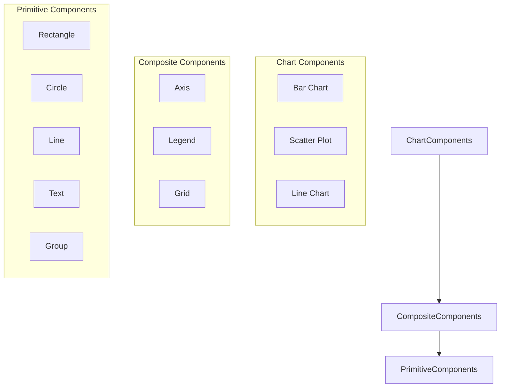
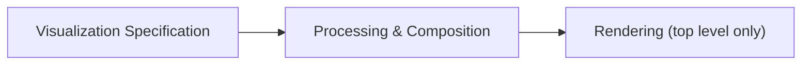
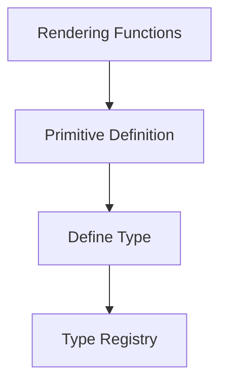
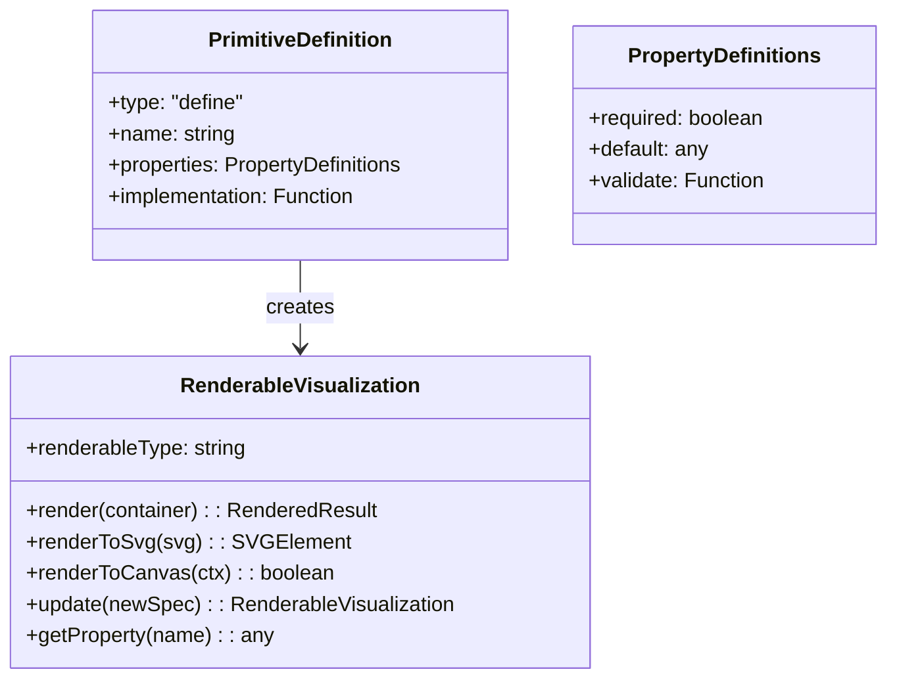
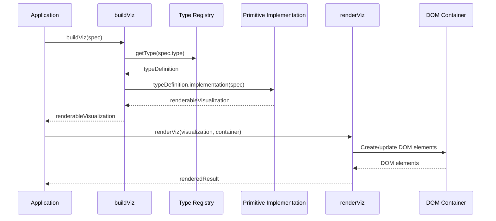

# Devize Primitives Design

## Overview

This document outlines the high-level design for primitive visualizations in Devize. These primitives serve as the fundamental building blocks for creating more complex visualizations through composition.

## Design Principles

1. **Functional First**: Primitives should be pure data transformations that don't directly render to the DOM.
2. **Container Independence**: Primitives should not require container elements except at the final rendering step.
3. **Composability**: All primitives should be designed for easy composition with other visualizations.
4. **Consistency**: All primitives should follow the same interface patterns.
5. **Rendering Agnostic**: Primitives should support multiple rendering backends (SVG, Canvas, etc.).

## Architecture

### Component Hierarchy



### Separation of Concerns

Each primitive follows a two-phase approach:



## Implementation Pattern

### Type Definition

All primitives are defined using the "define" type, which provides a consistent way to:
- Define required and optional properties
- Set default values
- Validate property values
- Register the new type with the system



### Common Structure

All primitives follow this common structure:



## Primitive Types

### Rectangle

A rectangle primitive that can be used for bars, backgrounds, etc.

**Properties:**
- `x`: X coordinate of the top-left corner
- `y`: Y coordinate of the top-left corner
- `width`: Width of the rectangle
- `height`: Height of the rectangle
- `fill`: Fill color
- `stroke`: Stroke color
- `strokeWidth`: Width of the stroke
- `cornerRadius`: Radius for rounded corners

### Circle

A circle primitive for points, nodes, etc.

**Properties:**
- `cx`: X coordinate of the center
- `cy`: Y coordinate of the center
- `r`: Radius of the circle
- `fill`: Fill color
- `stroke`: Stroke color
- `strokeWidth`: Width of the stroke

### Line

A line primitive for connections, axes, etc.

**Properties:**
- `x1`: X coordinate of the start point
- `y1`: Y coordinate of the start point
- `x2`: X coordinate of the end point
- `y2`: Y coordinate of the end point
- `stroke`: Stroke color
- `strokeWidth`: Width of the stroke
- `strokeDasharray`: Pattern of dashes and gaps

### Text

A text primitive for labels, annotations, etc.

**Properties:**
- `x`: X coordinate
- `y`: Y coordinate
- `text`: Text content
- `fontSize`: Font size in pixels
- `fontFamily`: Font family
- `fill`: Text color
- `textAnchor`: Text alignment ("start", "middle", "end")
- `dominantBaseline`: Vertical alignment

### Group

A group primitive for combining multiple visualizations.

**Properties:**
- `x`: X coordinate for translation
- `y`: Y coordinate for translation
- `children`: Array of child visualizations
- `transform`: Additional SVG transform
- `opacity`: Opacity of the group and its children

## Usage Pattern

All primitives follow this usage pattern:

```javascript
// Definition (no container)
const shapeSpec = buildViz({
  type: "rectangle",
  width: 100,
  height: 50,
  // other properties...
});

// Composition (no container)
const compositeSpec = buildViz({
  type: "group",
  children: [shapeSpec, otherShapeSpec]
});

// Rendering (container only at top level)
renderViz(compositeSpec, document.getElementById("container"));
```

## Rendering Process

The rendering process is separated from the definition to maintain the functional approach:



## Composition Example

### Simple Bar Chart

```javascript
function createBarChart(data) {
  return buildViz({
    type: "group",
    children: data.map((item, index) => ({
      type: "rectangle",
      x: index * 60 + 20,
      y: 200 - item.value * 10,
      width: 40,
      height: item.value * 10,
      fill: "steelblue"
    }))
  });
}

// Usage
const barChartSpec = createBarChart(myData);
renderViz(barChartSpec, document.getElementById("chart-container"));
```

## Future Enhancements

1. **Path Primitive**: Add a path primitive for complex shapes
2. **Image Primitive**: Add support for image elements
3. **Clipping**: Support for clipping regions
4. **Filters**: Visual filters like blur, shadow, etc.
5. **Animations**: Transition specifications for animations

## Conclusion

This design for primitive shapes provides a foundation for building more complex visualizations in Devize. By separating the definition from rendering and maintaining a functional approach, we enable better composability and reusability while simplifying the API.
