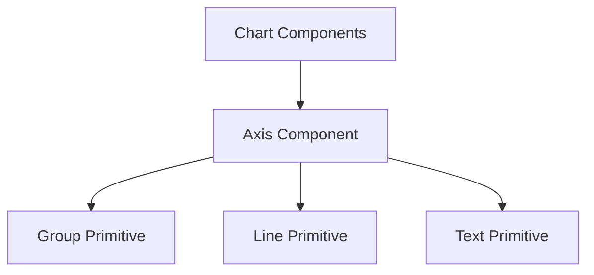

# Axis Component

## Purpose
The `axis` component renders a coordinate axis with ticks, labels, and an optional title. It's a fundamental building block for charts and visualizations that require coordinate systems.

## Properties

| Property | Type | Description | Default | Required |
|----------|------|-------------|---------|----------|
| orientation | string | The orientation of the axis ('top', 'right', 'bottom', 'left') | | Yes |
| length | number | The length of the axis in pixels | | Yes |
| values | array | The values to display as ticks | | Yes |
| positions | array | Custom positions for ticks (overrides automatic positioning) | null | No |
| scale | object | A scale object to use for positioning ticks | null | No |
| scaleType | string | Type of scale to create ('linear', 'band', etc.) if no scale is provided | null | No |
| domain | array | Domain for the scale if creating one on the fly | null | No |
| title | string | Title for the axis | '' | No |
| format | function | Function to format tick labels | value => value.toString() | No |
| transform | string | SVG transform to apply to the axis group | '' | No |
| tickCount | number | Number of ticks to generate when using a scale with a ticks method | 5 | No |

## Examples

### Basic Axis
```javascript
{
  type: 'axis',
  orientation: 'bottom',
  length: 500,
  values: [0, 25, 50, 75, 100],
  title: 'Values'
}
```

### Axis with Scale
```javascript
{
  type: 'axis',
  orientation: 'left',
  length: 300,
  values: [],  // Will be generated from scale
  scale: linearScale,
  title: 'Revenue ($)',
  format: value => '$' + value.toLocaleString()
}
```

### Axis with Custom Tick Positions
```javascript
{
  type: 'axis',
  orientation: 'bottom',
  length: 500,
  values: ['Q1', 'Q2', 'Q3', 'Q4'],
  positions: [50, 150, 350, 450],
  title: 'Quarters'
}
```

## Implementation Details

The axis component renders the following elements:
1. A main axis line
2. Tick marks at specified positions
3. Labels for each tick
4. An optional title

The component handles different orientations by adjusting the positioning and rotation of these elements. For band scales, it automatically positions ticks at the center of each band.

## Usage with Scales

The axis component works seamlessly with scale components:

```javascript
// First create a scale
{
  type: 'linearScale',
  domain: [0, 100],
  range: [0, 500],
  as: 'yScale'
},

// Then use it with an axis
{
  type: 'axis',
  orientation: 'left',
  length: 500,
  scale: props => props.yScale,
  title: 'Values'
}
```

## Customization

The axis appearance can be customized by modifying the implementation or by wrapping it in a custom component:

```javascript
// Define a custom axis with different styling
buildViz({
  type: "define",
  name: "customAxis",
  properties: {
    // Same properties as the standard axis
    orientation: { required: true },
    length: { required: true },
    values: { required: true },
    // Additional styling properties
    tickLength: { default: 6 },
    tickColor: { default: '#333' },
    labelFontSize: { default: 12 }
  },
  implementation: props => ({
    type: 'axis',
    orientation: props.orientation,
    length: props.length,
    values: props.values,
    // Pass through other properties
    ...props,
    // Custom implementation details could be added here
  })
});
```

## Rendering Process

The axis component follows the standard two-phase approach:
1. Definition and composition (using `buildViz`)
2. Rendering (using `renderViz` at the top level)

This separation allows for easy composition with other components before rendering.

## Component Hierarchy



## Renderable Visualization

The axis component returns a standard renderable visualization with the following methods:
- `render(container)`: Renders the axis to a DOM container
- `renderToSvg(svg)`: Renders the axis to an SVG element
- `renderToCanvas(ctx)`: Renders the axis to a Canvas context
- `update(newSpec)`: Updates the axis with new properties
- `getProperty(name)`: Gets a property value

## Complete Chart Example

```javascript
// Create scales
const xScale = buildViz({
  type: 'bandScale',
  domain: ['A', 'B', 'C', 'D'],
  range: [0, 400],
  padding: 0.2
});

const yScale = buildViz({
  type: 'linearScale',
  domain: [0, 100],
  range: [300, 0]
});

// Create axes
const xAxis = buildViz({
  type: 'axis',
  orientation: 'bottom',
  length: 400,
  scale: xScale,
  title: 'Categories'
});

const yAxis = buildViz({
  type: 'axis',
  orientation: 'left',
  length: 300,
  scale: yScale,
  title: 'Values'
});

// Create a chart with axes
const chart = buildViz({
  type: 'group',
  children: [
    // Position y-axis
    {
      type: 'group',
      x: 50,
      y: 50,
      children: [yAxis]
    },
    // Position x-axis
    {
      type: 'group',
      x: 50,
      y: 350,
      children: [xAxis]
    },
    // Add chart content here...
  ]
});

// Render the chart
renderViz(chart, document.getElementById('chart-container'));
```
