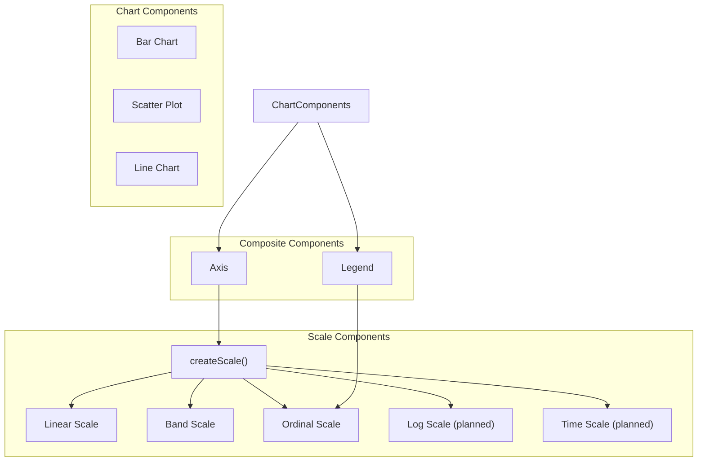

# Scale Components

## Overview

Scale components transform data values from an input domain to an output range. They are essential for mapping data to visual properties like position, size, and color in data visualizations.

## Component Hierarchy



## Scale Interface

All scale components implement the following interface:

```typescript
interface Scale {
  domain: any[];
  range: any[];
  scale: (value: any) => any;
  invert?: (value: any) => any;
  bandwidth?: () => number;
  ticks?: (count?: number) => any[];
}
```

## Types of Scales

### Linear Scale

Maps a continuous input domain to a continuous output range using linear interpolation. Ideal for quantitative data like measurements, counts, or percentages.

### Band Scale

Maps a discrete input domain to a continuous output range, dividing the range into bands with optional padding. Perfect for categorical data in bar charts or column charts.

### Ordinal Scale

Maps a discrete input domain to a discrete output range. Commonly used for categorical data when mapping to colors, shapes, or other discrete visual properties.

### Log Scale (Planned)

Maps a continuous input domain to a continuous output range using logarithmic interpolation. Useful for data that spans multiple orders of magnitude.

### Time Scale (Planned)

Maps time-based domains to a continuous output range. Designed for time series data.

## Creating Scales

Scales can be created in two ways:

### 1. Using the Factory Function

```javascript
import { createScale } from './components/scales/scale';

// Create a linear scale
const linearScale = createScale('linear', {
  domain: [0, 100],
  range: [0, 500],
  clamp: true
});

// Create a band scale
const bandScale = createScale('band', {
  domain: ['A', 'B', 'C', 'D'],
  range: [0, 400],
  padding: 0.2
});

// Create an ordinal scale
const ordinalScale = createScale('ordinal', {
  domain: ['Low', 'Medium', 'High'],
  range: ['#3366CC', '#FF9900', '#DC3912']
});
```

### 2. Using Direct Creation Functions

```javascript
import { createLinearScale } from './components/scales/linearScale';
import { createBandScale } from './components/scales/bandScale';
import { createOrdinalScale } from './components/scales/ordinalScale';

// Create a linear scale
const linearScale = createLinearScale([0, 100], [0, 500], {
  clamp: true
});

// Create a band scale
const bandScale = createBandScale(['A', 'B', 'C', 'D'], [0, 400], {
  padding: 0.2
});

// Create an ordinal scale
const ordinalScale = createOrdinalScale(['Low', 'Medium', 'High'],
  ['#3366CC', '#FF9900', '#DC3912']);
```

### 3. Using buildViz

```javascript
import { buildViz } from './core/builder';

// Create a linear scale
const linearScale = buildViz({
  type: 'linearScale',
  domain: [0, 100],
  range: [0, 500],
  clamp: true
});

// Create a band scale
const bandScale = buildViz({
  type: 'bandScale',
  domain: ['A', 'B', 'C', 'D'],
  range: [0, 400],
  padding: 0.2
});

// Create an ordinal scale
const ordinalScale = buildViz({
  type: 'ordinalScale',
  domain: ['Low', 'Medium', 'High'],
  range: ['#3366CC', '#FF9900', '#DC3912']
});
```

## Scale Properties

### Linear Scale

| Property | Type | Description | Default | Required |
|----------|------|-------------|---------|----------|
| domain | [number, number] | The input domain (data values) | | Yes |
| range | [number, number] | The output range (visual values) | | Yes |
| padding | number | Padding applied to the domain as a proportion | 0 | No |
| clamp | boolean | Whether to clamp values outside the domain | false | No |
| nice | boolean | Whether to extend the domain to nice round values | false | No |

### Band Scale

| Property | Type | Description | Default | Required |
|----------|------|-------------|---------|----------|
| domain | string[] | The input domain (categorical values) | | Yes |
| range | [number, number] | The output range (visual values) | | Yes |
| padding | number | Shorthand for both inner and outer padding (0-1) | 0.1 | No |
| paddingInner | number | Padding between bands (0-1) | padding | No |
| paddingOuter | number | Padding at the edges (0-1) | padding | No |
| align | number | Alignment of bands within step (0-1) | 0.5 | No |

### Ordinal Scale

| Property | Type | Description | Default | Required |
|----------|------|-------------|---------|----------|
| domain | string[] | The input domain (categorical values) | | Yes |
| range | any[] | The output range (visual values) | | Yes |
| unknown | any | Value to return for inputs not in the domain | range[0] | No |

## Scale Methods

### Linear Scale

| Method | Description |
|--------|-------------|
| scale(value: number): number | Maps a value from the domain to the range |
| invert(value: number): number | Maps a value from the range back to the domain |
| ticks(count?: number): number[] | Returns approximately `count` representative values from the domain |

### Band Scale

| Method | Description |
|--------|-------------|
| scale(value: string): number | Maps a value from the domain to the position of the corresponding band |
| bandwidth(): number | Returns the width of each band |
| ticks(): string[] | Returns all values in the domain |

### Ordinal Scale

| Method | Description |
|--------|-------------|
| scale(value: string): any | Maps a value from the domain to the corresponding range value |
| ticks(): string[] | Returns all values in the domain |

## Examples

### Linear Scale

```javascript
// Create a linear scale
const yScale = createScale('linear', {
  domain: [0, 100],
  range: [0, 500],
  clamp: true
});

// Usage
const pixelPosition = yScale.scale(75); // Returns 375
const dataValue = yScale.invert(250); // Returns 50
const tickValues = yScale.ticks(5); // Returns [0, 20, 40, 60, 80, 100]
```

### Band Scale

```javascript
// Create a band scale
const xScale = createScale('band', {
  domain: ['A', 'B', 'C', 'D'],
  range: [0, 400],
  padding: 0.2
});

// Usage
const bandStart = xScale.scale('B'); // Returns position of band B
const bandWidth = xScale.bandwidth(); // Returns width of each band
const categories = xScale.ticks(); // Returns ['A', 'B', 'C', 'D']
```

### Ordinal Scale

```javascript
// Create an ordinal scale
const colorScale = createScale('ordinal', {
  domain: ['Low', 'Medium', 'High'],
  range: ['#3366CC', '#FF9900', '#DC3912'],
  unknown: '#CCCCCC'
});

// Usage
const color = colorScale.scale('Medium'); // Returns '#FF9900'
const unknownColor = colorScale.scale('Unknown'); // Returns '#CCCCCC'
const categories = colorScale.ticks(); // Returns ['Low', 'Medium', 'High']
```

## Usage with Data Visualization

Scales are typically used to map data values to visual properties:

```javascript
// Create scales
const xScale = createScale('band', {
  domain: data.map(d => d.category),
  range: [0, width],
  padding: 0.2
});

const yScale = createScale('linear', {
  domain: [0, Math.max(...data.map(d => d.value))],
  range: [height, 0],
  nice: true
});

// Create bars
const bars = data.map(d => ({
  type: 'rectangle',
  x: xScale.scale(d.category),
  y: yScale.scale(d.value),
  width: xScale.bandwidth(),
  height: height - yScale.scale(d.value),
  fill: 'steelblue'
}));

// Create a group with the bars
const barGroup = buildViz({
  type: 'group',
  children: bars
});
```

## Composing with Axis Components

Scales are commonly used with axis components to create chart axes:

```javascript
// Create a scale
const yScale = createScale('linear', {
  domain: [0, 100],
  range: [300, 0],
  nice: true
});

// Create an axis using the scale
const yAxis = buildViz({
  type: 'axis',
  orientation: 'left',
  length: 300,
  scale: yScale,
  title: 'Values'
});

// Render the axis
renderViz(yAxis, document.getElementById('axis-container'));
```

## Implementation Details

### Linear Scale

The linear scale implements a simple linear interpolation:

```javascript
// For a domain [d0, d1] and range [r0, r1]
scale = (value) => {
  // Apply padding if specified
  const paddedDomainMin = d0 - (d1 - d0) * padding;
  const paddedDomainMax = d1 + (d1 - d0) * padding;

  // Calculate the scaled value
  let scaled = r0 + ((value - paddedDomainMin) / (paddedDomainMax - paddedDomainMin)) * (r1 - r0);

  // Apply clamping if specified
  if (clamp) {
    scaled = Math.max(r0, Math.min(r1, scaled));
  }

  return scaled;
};
```

### Band Scale

The band scale divides the range into equal-sized bands with optional padding:

```javascript
// For a domain of n categories
const step = n === 0 ? 0 : width / Math.max(1, n - paddingInner + 2 * paddingOuter);
const bandWidth = step * (1 - paddingInner);

// Calculate the start position based on alignment
const totalBandWidth = n * step - paddingInner * step;
const remainingSpace = width - totalBandWidth;
const start = rangeMin + (align * remainingSpace);

// Position each band
scale = (value) => {
  const index = domain.indexOf(value);
  if (index === -1) return NaN;
  return start + (paddingOuter * step) + (index * step);
};
```

### Ordinal Scale

The ordinal scale maps each domain value to a corresponding range value:

```javascript
scale = (value) => {
  const index = domain.indexOf(value);
  if (index === -1) return unknown; // Return unknown value for values not in domain
  return range[index % range.length];
};
```

## Fallback Implementations

The scale component includes minimal implementations for each scale type that are used as fallbacks when the full implementation cannot be extracted:

```javascript
// Minimal linear scale
createMinimalLinearScale({
  domain: [0, 100],
  range: [0, 500],
  clamp: true
});

// Minimal band scale
createMinimalBandScale({
  domain: ['A', 'B', 'C', 'D'],
  range: [0, 400],
  padding: 0.2
});

// Minimal ordinal scale
createMinimalOrdinalScale({
  domain: ['Low', 'Medium', 'High'],
  range: ['#3366CC', '#FF9900', '#DC3912'],
  unknown: '#CCCCCC'
});
```

## Complete Chart Example

```javascript
// Create scales
const xScale = createScale('band', {
  domain: ['A', 'B', 'C', 'D'],
  range: [0, 400],
  padding: 0.2
});

const yScale = createScale('linear', {
  domain: [0, 100],
  range: [300, 0]
});

// Create axes
const xAxis = buildViz({
  type: 'axis',
  orientation: 'bottom',
  length: 400,
  scale: xScale,
  title: 'Categories'
});

const yAxis = buildViz({
  type: 'axis',
  orientation: 'left',
  length: 300,
  scale: yScale,
  title: 'Values'
});

// Create bars
const bars = buildViz({
  type: 'group',
  children: [
    {
      type: 'rectangle',
      x: xScale.scale('A'),
      y: yScale.scale(45),
      width: xScale.bandwidth(),
      height: 300 - yScale.scale(45),
      fill: 'steelblue'
    },
    {
      type: 'rectangle',
      x: xScale.scale('B'),
      y: yScale.scale(90),
      width: xScale.bandwidth(),
      height: 300 - yScale.scale(90),
      fill: 'steelblue'
    },
    {
      type: 'rectangle',
      x: xScale.scale('C'),
      y: yScale.scale(60),
      width: xScale.bandwidth(),
      height: 300 - yScale.scale(60),
      fill: 'steelblue'
    },
    {
      type: 'rectangle',
      x: xScale.scale('D'),
      y: yScale.scale(75),
      width: xScale.bandwidth(),
      height: 300 - yScale.scale(75),
      fill: 'steelblue'
    }
  ]
});

// Create a chart with axes and bars
const chart = buildViz({
  type: 'group',
  children: [
    // Position y-axis
    {
      type: 'group',
      x: 50,
      y: 50,
      children: [yAxis]
    },
    // Position x-axis
    {
      type: 'group',
      x: 50,
      y: 350,
      children: [xAxis]
    },
    // Position bars
    {
      type: 'group',
      x: 50,
      y: 50,
      children: [bars]
    }
  ]
});

// Render the chart
renderViz(chart, document.getElementById('chart-container'));
```

## Conclusion

Scale components are fundamental building blocks for data visualization in Devize. They provide a flexible and powerful way to map data values to visual properties, enabling the creation of a wide variety of charts and visualizations.
