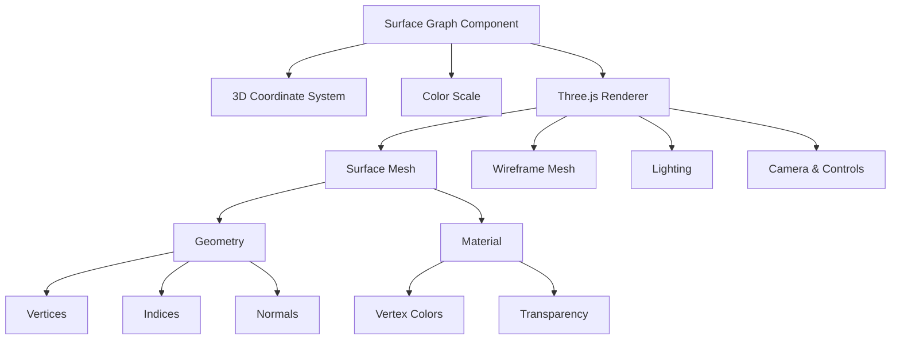

# Surface Graph Design

## Overview

The Surface Graph component renders a 3D surface visualization using Three.js. It's designed to display 3D data where values are represented as heights on a surface, with color mapping for additional data dimensions.

## Architecture

The Surface Graph follows the Devize component architecture pattern and integrates with the Three.js rendering system. It consists of:

1. **Component Definition**: Using the `define` type to declare properties and implementation
2. **Three.js Integration**: Leveraging the shared ThreeJsRenderer utility for 3D rendering
3. **Coordinate System**: Using the Cartesian3DCoordinateSystem for spatial mapping
4. **Color Mapping**: Supporting color scales to represent data values

## Component Structure

## Design Decisions

### 1. Three.js Integration

We chose to use Three.js for rendering because:
- It provides high-performance WebGL rendering
- It has built-in support for 3D meshes, lighting, and camera controls
- It's widely used and well-documented

### 2. Separate Rendering Path

Unlike 2D charts that can render to SVG or Canvas, 3D visualizations require WebGL. We've implemented:
- A placeholder for SVG rendering that displays a message
- A placeholder for Canvas rendering that displays a message
- A dedicated `renderToThreeJS` method that handles the actual 3D rendering

### 3. Coordinate System

We use the Cartesian3DCoordinateSystem to:
- Map data values to 3D space
- Support different projection types (orthographic, perspective, isometric)
- Handle domain scaling and transformations

### 4. Data Structure

The surface graph accepts data in a specific format:
- A 2D array of z-values representing the height at each point
- Optional arrays for x and y coordinates (defaults to indices if not provided)
- This format efficiently represents grid-based surfaces

### 5. Color Mapping

We use a color scale to:
- Map z-values to colors
- Provide visual cues about the height of the surface
- Support customizable color ranges

### 6. Interaction

The component supports:
- Rotation of the 3D view
- Zooming in and out
- Panning
- These interactions are implemented using OrbitControls from Three.js

## Implementation Considerations

### Performance

For large surfaces (many data points), we:
- Use BufferGeometry for efficient memory usage
- Compute vertex normals for proper lighting
- Optimize the number of draw calls

### Accessibility

Since 3D visualizations can be challenging for accessibility:
- We provide alternative text descriptions
- We ensure keyboard navigation for controls
- We maintain good color contrast for the wireframe

### Extensibility

The design allows for future extensions:
- Adding contour lines
- Supporting different surface types (parametric, etc.)
- Adding data point highlighting
- Implementing cross-sections

## Related Components

- **Scatter3DChart**: Shares the 3D rendering infrastructure
- **ContourMap**: A 2D representation of the same data
- **HeatMap**: Another way to visualize the same data in 2D
