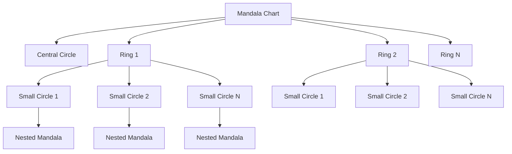
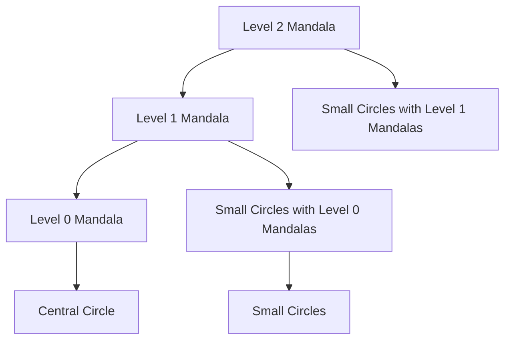
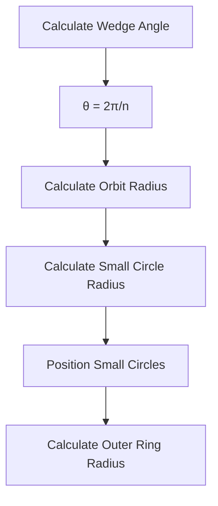
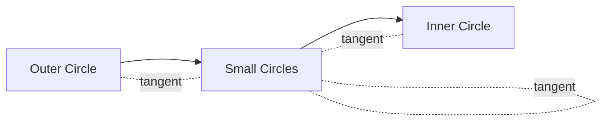

# Mandala Chart Design Document

## Overview

The Mandala Chart is a recursive visualization that creates a central circle surrounded by rings of smaller circles. Each small circle can contain a nested mandala chart, creating a fractal-like pattern. This document describes the design, implementation, and mathematical principles behind the Mandala Chart component.

## Visual Structure

A Mandala Chart consists of:

1. A central circle
2. One or more rings of smaller circles surrounding the central circle
3. Nested mandala charts inside each small circle (for recursion levels > 1)



## Recursive Structure

The mandala chart uses a recursive implementation where:

1. Level 0 is just a central circle
2. Level 1 adds a ring of small circles around the central circle
3. Level 2+ adds more rings and also places nested mandalas inside each small circle



## Mathematical Principles

### Circle Packing Geometry

The key mathematical challenge is determining the size and position of small circles so they:

1. Are tangent to each other
2. Are tangent to both the inner and outer circles of the ring
3. Are evenly distributed around the ring

### Calculating Circle Positions

For a ring with `n` small circles:

1. The angular width of each wedge/slice is `θ = 2π/n`
2. The small circles are positioned at angles `θ_i = (i * θ) + π/2 + rotationOffset`
3. The orbit radius (distance from center to small circle centers) is calculated based on the inner ring radius



### Tangent Circle Calculations

For a ring with inner radius `r_outer`, the key calculations are:

1. The wedge angle: `θ = 2π/n`
2. The sine of half the wedge angle: `sin(θ/2)`
3. The orbit radius: `r_orbit = r_outer / (1 + sin(θ/2))`
4. The small circle radius: `r_small = r_orbit * sin(θ/2)`
5. The inner ring radius: `r_inner = r_orbit - r_small`

This ensures that:

- Small circles are tangent to each other (touching but not overlapping)
- Small circles are tangent to the inner circle
- Small circles are tangent to the outer circle



## Implementation Details

### Recursive Algorithm

The implementation uses a bottom-up recursive approach:

1. First recurse down to level 0 (just a central circle)
2. For each higher level:
   - Add a ring of small circles around the previous level
   - For each small circle, recursively create a nested mandala of the previous level

### Drawing Order

The drawing order is critical to ensure proper layering:

1. Draw the central circle first
2. Draw container circles for each ring from innermost to outermost
3. Draw small circles for each ring
4. Draw nested mandalas inside small circles

### Scaling for Nested Mandalas

For nested mandalas inside small circles:

1. The container radius is the small circle radius
2. The central circle radius is scaled proportionally to maintain the same ratio as the top-level chart
3. A rotation offset is applied to align the nested mandala with its parent circle's position

## Configuration Options

The Mandala Chart supports various configuration options:

| Option | Description | Default |
|--------|-------------|---------|
| centralRadius | Radius of the central circle | '30%' |
| centralColor | Color of the central circle | '#f0f0f0' |
| smallCircleColors | Array of colors for small circles | ['#1f77b4', ...] |
| containerCircleColor | Color of the container circles | 'rgba(0,0,0,0.05)' |
| centralStroke | Stroke color for central circle | '#333' |
| smallCircleStroke | Stroke color for small circles | '#333' |
| containerCircleStroke | Stroke color for container circles | '#999' |
| strokeWidth | Stroke width for central and small circles | 1 |
| containerStrokeWidth | Stroke width for container circles | 1 |
| numPositions | Number of positions in each ring | 10 |
| recursionLevels | Number of recursion levels | 1 |
| innerPadding | Padding inside small circles | 0.1 |
| ringGap | Gap between rings | 0.05 |
| hideZeroPosition | Whether to hide the 0th position | true |

## Usage Examples

### Basic Mandala Chart

```javascript
const basicChart = createMandalaChart({
  width: 500,
  height: 500,
  title: "Mandala Chart",
  margin: { top: 40, right: 40, bottom: 40, left: 40 }
});
```

### Customized Mandala Chart

```javascript
const customChart = createMandalaChart({
  width: 600,
  height: 600,
  title: {
    text: "Customized Mandala Chart",
    fontSize: 20,
    fontWeight: "bold",
    color: "#333"
  },
  margin: { top: 50, right: 50, bottom: 50, left: 50 },
  centralRadius: '25%',
  smallCircleColors: [
    '#1565c0', '#0097a7', '#00796b', '#388e3c',
    '#689f38', '#afb42b', '#fbc02d', '#f57c00', '#e64a19'
  ],
  centralStroke: '#01579b',
  smallCircleStroke: '#01579b',
  strokeWidth: 2,
  recursionLevels: 3,
  numPositions: 8
});
```

## Performance Considerations

The recursive nature of the Mandala Chart can lead to a large number of elements being rendered, especially at higher recursion levels. For example:

- Level 1 with 10 positions: 1 central circle + 1 container circle + 9 small circles = 11 elements
- Level 2 with 10 positions: 11 elements + 9 nested mandalas with 11 elements each = 110 elements
- Level 3 with 10 positions: 110 elements + 9*9 nested mandalas with 11 elements each = 1,001 elements

To maintain performance:

1. Limit recursion levels for large charts
2. Consider reducing the number of positions for higher recursion levels
3. Use efficient rendering techniques (SVG or Canvas)

## Future Enhancements

Potential future enhancements for the Mandala Chart include:

1. Data-driven coloring and sizing of circles
2. Interactive features (hover, click, zoom)
3. Animation capabilities
4. Text labels for circles
5. Variable number of positions per level
6. Support for different shapes beyond circles
