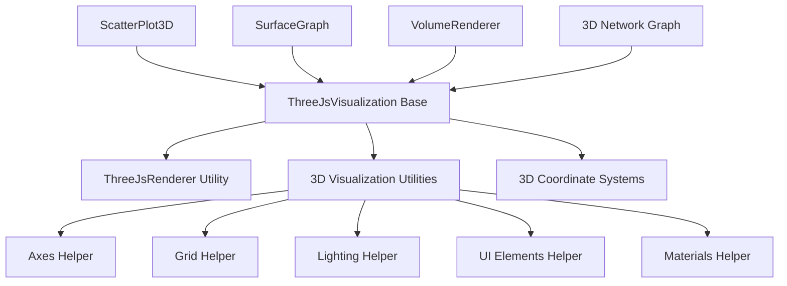

# 3D Visualization Components Refactoring Plan

## Overview

This plan outlines the refactoring of our 3D visualization components to improve code reuse, maintainability, and extensibility. Currently, we have implemented `scatterPlot3D` and `surfaceGraph` with significant code duplication. This refactoring will extract common functionality into shared utilities and base components.

## Goals

1. Reduce code duplication between 3D visualization components
2. Create a consistent API for 3D visualizations
3. Simplify the creation of new 3D visualization types
4. Improve performance through shared rendering infrastructure
5. Enhance testability of 3D visualization components

## Proposed Architecture



## Components to Create/Refactor

### 1. ThreeJsVisualization Base Component

Create a base component that handles:
- Three.js scene setup
- Camera configuration
- Controls setup
- Rendering loop
- Common event handling
- Container management

```typescript
// Proposed API
const viz = new ThreeJsVisualization({
  width: 800,
  height: 600,
  backgroundColor: 0xf0f0f0,
  camera: {
    type: 'perspective',
    position: { x: 100, y: 100, z: 100 },
    target: { x: 0, y: 0, z: 0 }
  },
  controls: {
    enableRotate: true,
    enableZoom: true,
    enablePan: true,
    autoRotate: false
  }
});

// Add content
viz.addAxes();
viz.addGrid();
viz.addLighting();

// Custom content
viz.scene.add(myCustomObject);

// Attach to DOM
viz.attach(containerElement);
```

### 2. 3D Visualization Utilities

Create utility modules for common 3D visualization tasks:

#### a. Axes Helper
- Create customizable axes with labels
- Support different axis styles and scales
- Integrate with coordinate systems

#### b. Grid Helper
- Create customizable grids for different planes
- Support different grid styles and densities

#### c. Lighting Helper
- Standard lighting setups (basic, studio, outdoor, etc.)
- Customizable light positions and intensities

#### d. UI Elements Helper
- Title rendering
- Legend creation
- Tooltip management
- Controls UI

#### e. Materials Helper
- Standard material presets
- Material factories for different visualization types

### 3. Integration with Coordinate Systems

Enhance the 3D coordinate systems to:
- Provide better integration with Three.js
- Support different projection types
- Handle domain mapping consistently
- Support animation and transitions

## Implementation Phases

### Phase 1: Extract Common Utilities
- Create the 3D visualization utilities module
- Move common helper functions from existing components
- Create tests for utilities

### Phase 2: Create Base Visualization Component
- Implement ThreeJsVisualization base component
- Create comprehensive documentation
- Develop examples showcasing the base component

### Phase 3: Refactor Existing Components
- Refactor scatterPlot3D to use the new architecture
- Refactor surfaceGraph to use the new architecture
- Ensure backward compatibility

### Phase 4: Enhance and Extend
- Add new features enabled by the architecture
- Create additional 3D visualization types
- Optimize performance

## Related Refactoring Plans

This plan should be coordinated with:
1. Coordinate System Refactoring Plan
2. Rendering Infrastructure Refactoring Plan
3. Axes and Scales Refactoring Plan

## Success Criteria

1. Reduced code size in individual visualization components
2. Improved test coverage
3. Consistent API across 3D visualization components
4. Simplified creation of new 3D visualization types
5. Maintained or improved performance
